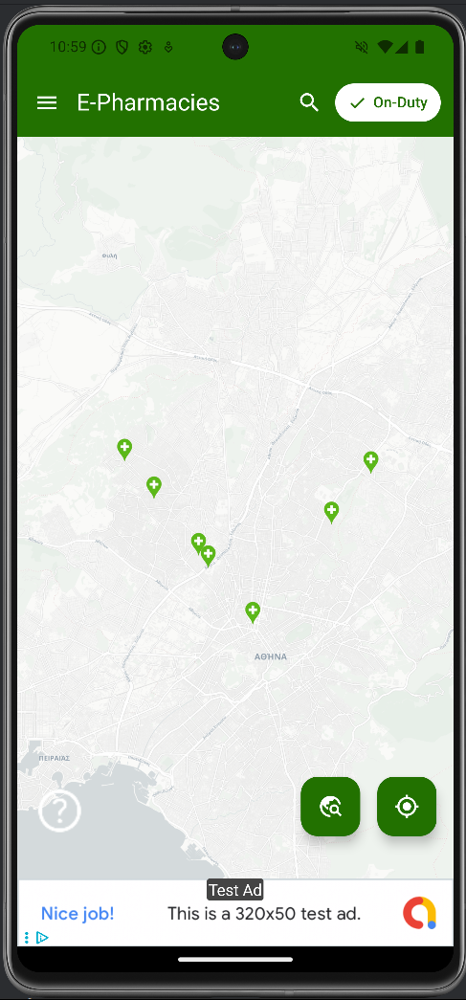
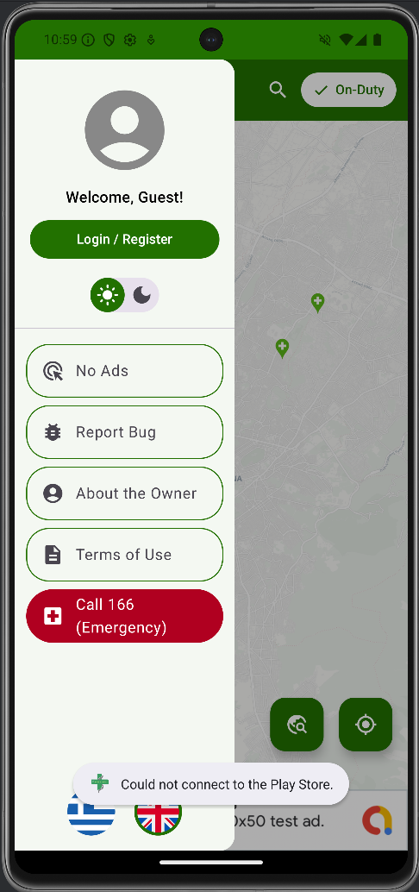
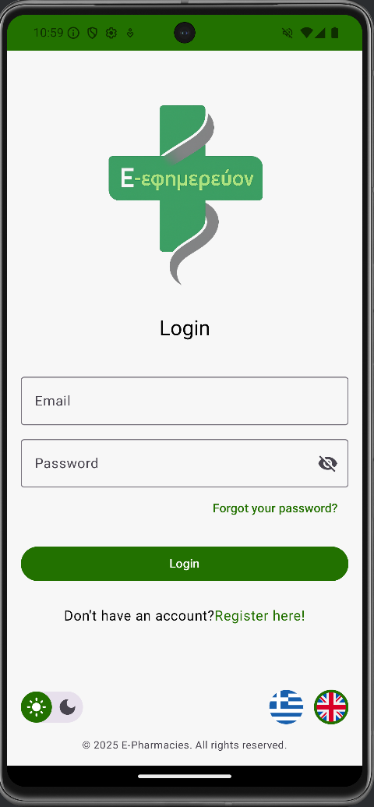
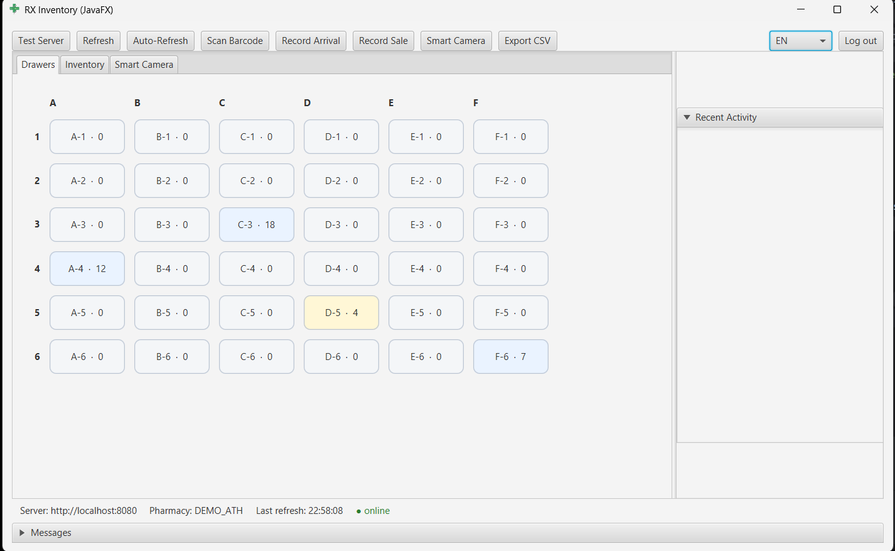
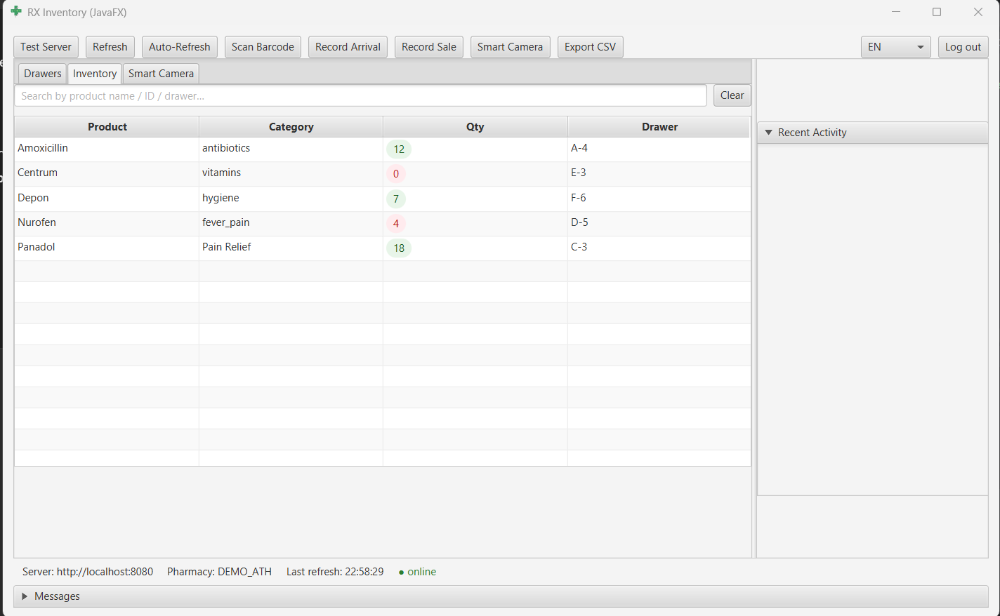

# E-Efimerevon & Inventory Management 

This repository is a **demonstration showcase** of a small, integrated pharmacy platform I built — combining:

- **Citizen Mobile App** (Android · Kotlin · Jetpack Compose)
- **Inventory Management Desktop App** (JavaFX)
- **Smart Security Camera** (JavaFX + OpenCV face recognition)
- **Backend Service** (Ktor + Firebase Firestore · NoSQL)

All components **work together in real time**, sharing data through a **server-authoritative backend** that maintains a **public-safe mirror** of inventory counts for citizens while keeping private stock details available only to pharmacy staff.

---

This is a **visual and conceptual overview** of the pharmacy platform I built.  

The goal of the system was simple:
> **Help people quickly find an on-duty pharmacy and know if the medicine they need is actually available.**

At the same time:
> **Pharmacies should be able to update their inventory easily, privately, and with whatever scanner they already have.**

So the platform is split into **two experiences**:

---

## 1) Citizen App (Android · Jetpack Compose)
A simple, accessible mobile app designed for **any age** to use — from “5 years old to 70 years old”.

**Features:**
- **Map** of nearby pharmacies
- **On-duty / open now** indicators
- **Live availability counts**
- Designed to be **simple**, **readable**, and **stress-free**

**Privacy consideration:**  
Citizens **only see counts.**  
No drawer numbers, no stockroom details, no employee data.

### Screenshots

| Map View | App Menu | Login Screen |
|---|---|---|
|  |  |  |

---

## 2) Inventory Desktop App (JavaFX)
Used by the pharmacy **staff**.

**Main capabilities:**
- Fast **ARRIVAL** and **SALE** updates
- Works with **barcode scanners**
- **Drawer organization** (A–F × 1–6)
- **Search**, **low-stock highlight**, **multi-language (EN/GR)**

The workflow is:
**Scan → Confirm → Stock Updates**

### Screenshots

| Drawer Grid | Inventory Table |
|---|---|
|  |  |

---

## 3) Smart Security Camera (JavaFX + OpenCV)
Integrated into the desktop app as a **one-click launch**.

**What it demonstrates:**
- **Local face recognition**
- **Live camera preview**

---

## 4) The Backend (Ktor + Firestore)
A small, **server-authoritative** backend ensures **one source of truth**.

Whenever staff updates stock:

`Scan → Backend validates → Stock updates → Public mirror updated → Citizen app sees new count`

This makes the system:
- **Consistent**
- **Fast**
- **Safe to expose to the public**

And it works with **any scanner** → because input is just **HTTP**.

---

## Why I Built It
When I first moved to Thessaloniki, I found it **hard to know which pharmacy was on duty**, and even harder to know whether they actually had what I needed.

So I built a solution that is:
- **Easy to use**
- **Accurate**
- **Privacy-first**
- **And works with the hardware pharmacies already have**

---

## Contact

**LinkedIn:** https://www.linkedin.com/in/klearxos-xlioumphs/  
**GitHub:** https://github.com/RaeXp917  

---

## License
Media and documentation © 2025 **Klearxos Xlioumphs**  
Licensed under **CC BY-NC 4.0** (non-commercial use, attribution required).
